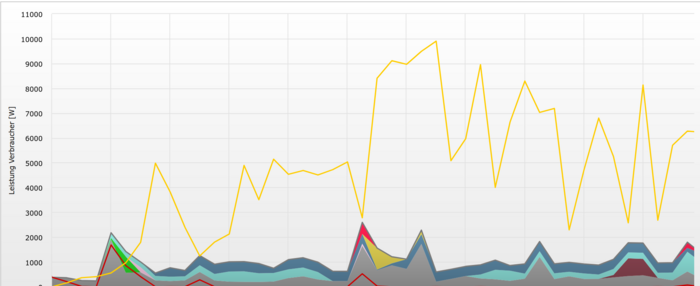
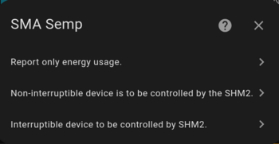

[Translation of this page via google translator](https://translate.google.com/translate?js=n&sl=auto&tl=en&u=https://github.com/littleyoda/ha-sma-semp)

- [Vorbemerkung](#vorbemerkung)
- [Einleitung](#einleitung)
- [Installation](#installation)
- [Konfiguration](#konfiguration)
  - [Hinzufügen von neuen Geräten (in Home Assistant)](#hinzufügen-von-neuen-geräten-in-home-assistant)
  - [Kalendar Einträge](#kalendar-einträge)
  - [Hinzufügen von neuen Geräten (in Sunny Portal)](#hinzufügen-von-neuen-geräten-in-sunny-portal)
- [Classic Portal](#classic-portal)
- [Enneos Portal](#enneos-portal)
- [Detailinformationen / Fehlersuche](#detailinformationen--fehlersuche)
  - [Statuswebseite](#statuswebseite)
  - [Sensor-Attribute](#sensor-attribute)
  - [GUI Dashboard](#gui-dashboard)
  - [Sunny Portal](#sunny-portal)
- [FAQ](#faq)
  - [Netzwerk](#netzwerk)
  - [Begrenzung der Geräteanzahl](#begrenzung-der-geräteanzahl)
  - [Abgrenzung von HA-SMA-Semp zu anderen Lösungen](#abgrenzung-von-ha-sma-semp-zu-anderen-lösungen)
  - [Werden Wallboxen unterstützt?](#werden-wallboxen-unterstützt)
  - [SEMP-Protokoll](#semp-protokoll)

# Vorbemerkung

In diese Integration wurde sehr viel Zeit investiert. Insbesondere wenn ihr durch die Integration Stromkosten spart, würde ich mich freuen, wenn ihr euch in irgendeiner Form bedankt. Beispiele gibt es (hier)[https://littleyoda.github.io/].


# Einleitung

HA-SMA-Semp ermöglicht die Einbindung beliebiger Geräte, die vom Home Assistant unterstützt werden, in das Sunny Portal von SMA mit Hilfe des Sunny Home Managers 2.0 ("SHM2"). Genutzt wird hierfür das SEMP-Protokoll.

Im einfachsten Fall kann der Verbrauch der Geräte an den SHM2 gemeldet werden, so dass der Stromverbrauch der Geräte im Portal angezeigt wird. Das Gerät wird durch den SHM2 aber nicht gesteuert. 



Jede Farbe in diesem Diagramm steht für den Stromverbrauch eines anderen Gerätes. Das SEMP Proktoll unterstützt nur Verbraucher. Erzeuger können über diesen Weg nicht integriert werden.


Im komplexeren Fall kann das Energiemanagement die Geräte aktiv steuern. Dazu wird z.B. festgelegt, wie lange das Gerät pro Tag laufen soll. Das SHM 2 schaltet das Gerät dann aktiv ein und aus, um das Gerät mit möglichst viel PV-Strom zu versorgen.


 
Unterschieden werden hierbei Geräte, die bei ihrer Arbeit unterbrochen werden dürfen (z.B. Wasserpumpen) und Geräte, die durchlaufen müssen. 


Für mehr Informationen bzgl. SEMP und Geräteverwaltung sei auf die Kapitel 11 (Gerätevewrwaltung) und 13 (Visualisierung des Energiemanagements) in der (SHM 2.0 Anleitung)[https://www.sunnyportal.com/Documents/HM-20-BE-de-19.pdf] verwiesen.


# Installation

Die einfachste Installation erfolgt mit Hilfe von HACS.

Dazu muss HACS bereits [installiert](https://hacs.xyz/) sein.

Folgende Schritte sind notwendig:
* Hinzufügen der Integration:<br>[](https://my.home-assistant.io/redirect/hacs_repository/?owner=littleyoda&repository=ha-sma-semp&category=integration)
* Anschließend auf Download klicken und den Download bestätigen
* Nach dem Download der Integration muss Home Assistant zwingend neugestartet werden:<br>[](https://my.home-assistant.io/redirect/system_dashboard/)

# Konfiguration

## Hinzufügen von neuen Geräten (in Home Assistant)

[](https://my.home-assistant.io/redirect/config_flow_start/?domain=smasemp)

Drei Möglichkeiten stehen anschließend zur Auswahl:



| Basiskonfiguration "report only"<br>Stromverbrauch an Sunny Portal melden    |    |
|-----|-----|
| _Name_<br>Name des Gerätes<br><br>_Sensor_<br>Sensor für Stromverbrauch (Einheit W oder kW) oder<br> Helfer-Entitiy vom Type Nummer <br><br>_Device Type_<br>Gerätetype<br><br>_ID_<br>Global eindeutiger Identifizierer<br><br>_Max Power Consumption_<br>Maximaler Verbrauch laut Typenschild<br>    |  |


| Erweitere Konfiguration "Non-Interruptible"<br>Geräte durch SHM2 steuern lassen  |    |
|-----|-----|
| _Min Power Consumption_<br>Minimaler Verbrauch laut Typenschild<br><br>_Minimum/Maximum running time_<br>Minimale und Maximale Laufzeit<br><br>_Calendar_<br>Kalender dessen Einträge mögliche Zeitfenster definiert,<br> in den das Gerät gemäß der vorgebene Laufzeiten ein-<br> und ausgeschaltet werden kann.<br><br>_On/Off switch_<br><br>Switch oder Helfer-Entitiy vom Type Schalter | [](doc/images/orig/config-not-interruptible.png) |

| Erweitere Konfiguration "Interruptible"<br>Unterbrechbare Geräte durch SHM2 steuern lassen  |    |
|-----|-----|
| _Min On Time_<br>Wie lange das Gerät mindestens eingeschaltet sein muss, <br> bevor es wieder ausgeschaltet werden darf.<br><br>_Min Off Time_<br>Wie lange das Gerät mindestens ausgeschaltet sein muss,<br> beovr es eingeschaltet werden darf. | [](doc/images/orig/config-interruptible.png) |

## Kalendar Einträge
Die Kalendereinträge werden verwendet, um dem Energiemanagementsystem (SHM2) mitzuteilen, in welchem Zeitraum die Geräte grundsätzlich laufen dürfen. Mit „Minimum running time“ und „Maximum running time“ wird festgelegt, wie lange die Geräte mindestens bzw. maximal laufen dürfen.

Die Kalendereinträge werden den einzelnen Geräten über den Title zugeordnet. Der Title der Kalendereinträge muss somit dem Gerätenamen übereinstimmen.


[](doc/images/calendar.png)

Beispiel: Durch den Kalendereintrag wird festgelegt, dass die Pumpe grundsätzlich zwischen 8:00 und 18:00 Uhr laufen darf. Durch „Minimale Laufzeit: 4 h“ und „Maximale Laufzeit: 6 h“ wird festgelegt, dass die Pumpe mindestens 4 Stunden lang zwischen 8:00 und 18:00 Uhr laufen soll. 
Bei ausreichendem PV-Überschuss kann die Pumpe bis zu zwei weitere Stunden laufen, also insgesamt maximal 6 Stunden zwischen 8:00 und 18:00 Uhr. 


## Hinzufügen von neuen Geräten (in Sunny Portal)
Nachdem die Geräte in Home Assitant angelegt wurden, müssen sie dem Sunny Portal hinzugefügt werden.

# Classic Portal

Einige Zeit (bis zu 15 min) nach der Anlage in Home Assistant werden die neue Geräte unter Anlagenüberwachung angezeigt.

[](doc/images/sunnyportal-anlagenüberwachung.png)

[](doc/images/sunnyportal-add.png)

# Enneos Portal

TODO

# Detailinformationen / Fehlersuche
## Statuswebseite
Für die verlinkte URL, können zusätzliche Informationen zur Fehlersuche aufgerufen werden:


Neben der Information, ob der SHM 2.0 die Daten abruft, ist erkennbar, welche Daten an den SHM 2.0 gemeldet wurden und ob der SHM 2.0 Steuerbefehle gesendet hat.

Die Seite kann auch direkt über die URL <hostname/ip>/sempinfo/ aufgerufen werden.


## Sensor-Attribute
In den Attributen der Status-Sensoren sind noch weitere Informationen hinterlegt:


- welche Zeiträume im Kalendar für dieses Gerät gefunden wurde
- ob und wenn ja, wie lange, dass Gerät im aktuellen Zeitfenster bereits eingeschalten war
- Protokoll, wann das Gerät ein- und ausgeschaltet wurde

## GUI Dashboard
Für eine bessere Übersicht empfehle ich ein Dialog mit Hilfe von [Lovelance Auto Entities](https://github.com/thomasloven/lovelace-auto-entities) zu erstellen, der alle Sensoren der Integration anzeigt:

```
  - type: custom:auto-entities
    card:
      type: entities
      state_color: true
    filter:
      include:
        - device_model: SMA Semp Adapter
      exclude: []
    sort:
      method: friendly_name
```


## Sunny Portal

TODO

# FAQ
## Netzwerk
Home Assitent und SHM2 müssen sich im gleichen Subnetz befinden, damit eine Kommunikation funktioniert.

## Begrenzung der Geräteanzahl
Alle Geräte, die dem Sunny Home Manager von HA-SMA-Semp zur Verfügung gestellt werden, gelten als schaltbare Geräte. Der Sunny Home Manager 2.0 unterstützt insgesamt maximal 12 aktiv schaltbare Geräte

## Abgrenzung von HA-SMA-Semp zu anderen Lösungen
Der Funktionsumfang von HA-SMA-Semp ist vergleichbar mit [SMA Semp Adapter für ioBroker](https://github.com/rg-engineering/ioBroker.semp) oder [Addon für Openhab](https://community.openhab.org/t/new-service-sma-semp-protocol-addons-io/59852).

Mit dem [Smart Appliance Enabler (SAE)](https://github.com/camueller/SmartApplianceEnabler) existiert bereits eine sehr umfassende Lösung, die unabhängig von einem Home Automation System Geräte steuern und den Verbrauch an das Sunny Portal melden kann. 

Während SAE verschiedene Schnittstellen implementiert, um auf die Geräte zuzugreifen oder das Ein- und Ausschaltsignal zu melden, nutzt HA-SMA-SEMP hier die Funktionalität des Home Assistant. HA-SmaSemp kann praktisch jedes Gerät nutzen, das über einen Sensor seinen Verbrauch melden kann oder über Home Assistant ein- und ausgeschaltet werden kann.

## Werden Wallboxen unterstützt?
Derzeit können Wallboxen nur ein- und ausgeschaltet werden. Die zusätzlichen Funktionen des SEMP-Protokolls für Wallboxen werden derzeit noch nicht unterstützt.

## SEMP-Protokoll
Mehr Informationen über das SEMP-Protokoll kann auf der [SMA Webseite](https://developer.sma.de/on-site-integration) nachgelesen werden.
